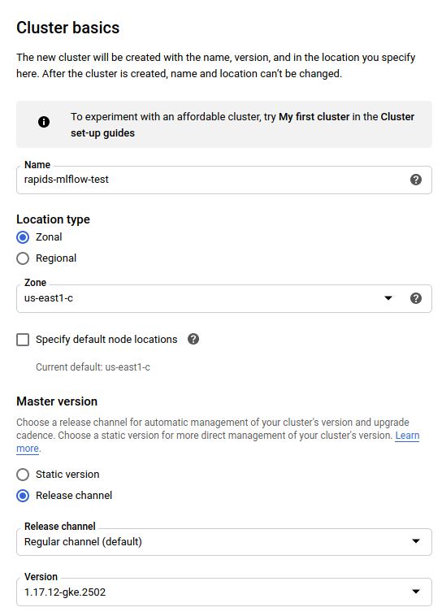
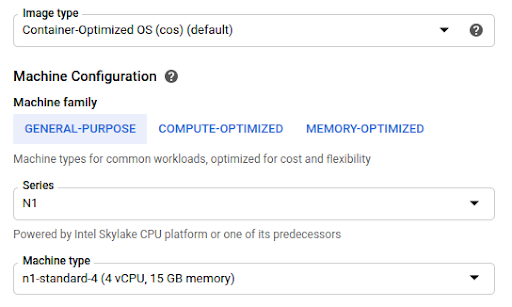
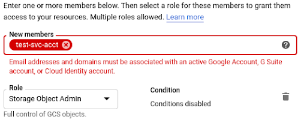

# [Detailed Google Kubernetes Engine (GKE) Guide](#anchor-start)
## [Create a GKE Cluster](#anchor-create-cluster)
__Verify Adequate GPU Quotas__

Depending on your account limitations, you may have restricted numbers and types of GPUs that can be allocated within a given zone or region.

- Navigate to your [GCP Console](https://console.cloud.google.com/)
- Select "IAM & Admin" $\rightarrow$ "Quotas"  
      
    - Filter by the type of GPU you want to add ex ‘T4’, ‘V100’, etc...
    - Select __ALL QUOTAS__ under the __Details__ column
    - If you find that you’re not given the option to assign GPUs during cluster configuration, re-check that you have an allocated quota.

## [Configure the Cluster hardware](#anchor-configure-cluster)
Once you’ve verified that you can allocate the necessary hardware for your cluster, you’ll need to go through the process 
of creating a new cluster, and configuring node pools that will host your services, and run MLflow jobs.

__Allocate the Appropriate Hardware__

- Navigate to your [GCP Console](https://console.cloud.google.com/)
- Select __Kubernetes Engine__ $\rightarrow$ __Clusters__
- Create a new cluster; for our purposes we'll assume the following values:  
    
- Create two sets of node-pools: __cpu-pool__ and __gpu-pool__
    - This is a good practice that can help reduce overall costs, so that you are not running CPU only
    tasks on GPU enable nodes. GKE will automatically taint GPU nodes so that they will be unavailble for
    tasks that do not request a GPU.
    - __CPU Pool__  
          
          
    - __GPU Pool__   
          
          
- Click __Create__ and wait for your cluster to come up.

## [Configure Kubectl](#anchor-kubectl)
__Obtain Kubectl Cluster Credentials from GKE.__
- First, be sure that [Kubectl is installed](https://kubernetes.io/docs/tasks/tools/install-kubectl/)
- Once your cluster appears to be up, running, and reported green by GKE, we need use __glcoud__ to configure kubectl
with the correct credentials.
   ```shell script
   gcloud container clusters get-credentials rapids-mlflow-test --region us-east1-c
   ```
   - Once this command completes, your kubektl's default configuration should be pointing to your GKE cluster instance,
   and able to interact with it.
       ```shell script
      kubectl config get-contexts
      
      CURRENT   NAME                 CLUSTER            AUTHINFO            NAMESPACE
      *         gke_[YOUR_CLUSTER]   gke_[YOUR_CLUSTER] gke_[YOUR_CLUSTER]  default
       ```
        
       ```shell script
       kubectl get all
       ```
__Create an Up to Date NVIDIA Driver Installer.__  
As of this writing, this step is necessary to ensure that a CUDA 11 compatible driver (450+) is installed on your worker nodes.

```shell script
kubectl apply -f https://raw.githubusercontent.com/GoogleCloudPlatform/container-engine-accelerators/master/nvidia-driver-installer/cos/daemonset-nvidia-v450.yaml
```

## [Create a Storage Bucket and Make it Accessible from GKE](#anchor-create-storage-bucket)
You need to create a storage bucket that can read and write to from your GKE cluster. This will host the training data,
as well as providing an endpoint for MLflow to use as artifact storage. For this, you’ll need two items: the bucket itself,
and a service account that you can use to authenticate with, from GKE.

[__Create a Service Account__](#anchor-create-service-account)
- Navigate to your [GCP Console](https://console.cloud.google.com/)
- Select "IAM & Admin" $\rightarrow$ "Service Acccounts"  
    
- Create a new account; for our purposes set:
    - Service Account Name: __test-svc-acct__
    - Service Account ID: __test-svc-acct@[project].iam.gserviceaccount.com__
    - Skip optional steps and click 'Done'.
- Find your service account in the account list, and click on the navigation dots in the far right cell, titled __Actions__,
select __Create Key__.
    - You will be prompted to create and download a private key.
    Leave the key type as 'JSON' and click create.
    - Save the file you are prompted with as __keyfile.json__
    - You will inject this, as a secret, into your GKE cluster.

## [Create a Storage Bucket and Attach Your Service Account](#anchor-config-storage-bucket)
- Navigate to your [GCP Console](https://console.cloud.google.com/)
- Select __Storage__ $\rightarrow$ __Browser__  
      
- Create a new bucket, with a unique name
    - I'll refer to this as __\${YOUR_BUCKET}__
    - Leave the default settings and click __Create__
- Now find your bucket in the storage browser list, and click on it.
- Click on __Permissions__ $\rightarrow$ __Add__  
      
      
- Add the service account you created in the previous step, and give it the role of __Storage Object Admin__ so that it will be
able to read and write to your bucket.
      
- Click __Save__
    
