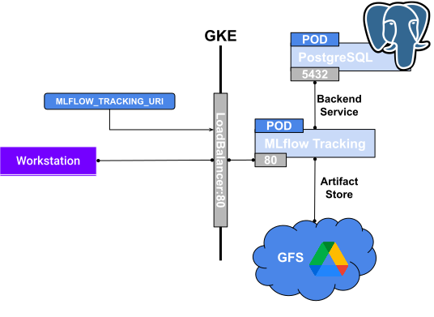
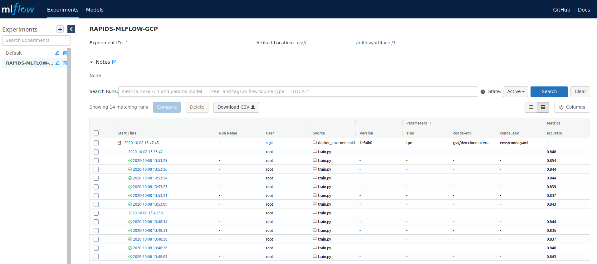

# End to End - RAPIDS, hyperopt, and MLflow, on Google Kubernetes Engine (GKE).
## Pre-requisites
__For this example purposes of this example we'll be using a subset of the 'airline' dataset. From this, we will build a
simple random forest classifier that predicts whether or not a flight will be LATE or ON-TIME.__
***
- **Basic Environment Requirements**
    - You will need to have a GKE cluster running, with at least 1 CPU node, and at least 1 GPU node (P100/V100/T4).
        - **Note:** As of this writing, you will need to choose the 'N1' node types in order for GPU's to be selectable.
        - **Note:** For the purposes of this demo, we will assume our k8s nodes are provisioned as follows:
            - Version: __1.17.9-gke.6300__
            - Image: __Container-Optimized OS(cos)__
            - Machine Type: __n1-standard-04__
        - **Note:** There will be some configuration parameters specific to your GKE cluster, we will refer to these as
        follows:
            - YOUR_PROJECT: The name of the GCP project where your GKE cluster lives.
            - YOUR_BUCKET: The name of the GCP storage bucket where your data will be stored. 
            - MLFLOW_TRACKING_UI: The URI of the tracking server we will deploy to your GKE cluster.
        - For more information, check out [GKE Overview](https://cloud.google.com/kubernetes-engine/docs/concepts/kubernetes-engine-overview).
    - You will need to have your `kubectl` utility configured with the credentials for you GKE cluster instance.
        - For more information, check out [GKE cluster's context](https://cloud.google.com/kubernetes-engine/docs/how-to/cluster-access-for-kubectl#generate_kubeconfig_entry).
    - You will need to upload files to a GCP bucket that your cluster project has access to.
        - For more information, check out [GCP's documentation](https://cloud.google.com/storage/docs/uploading-objects).
    - Configure Authentication:
        - You will need to create a [Service Account](https://cloud.google.com/iam/docs/creating-managing-service-accounts),
        __Create a Key__ and store the resulting keyfile.json.
        - Using the GCP console, navigate to ${YOUR_BUCKET}, select **permissions**, and add your newly created service
        account with 'Storage Object Admin' permissions.
    - Get the mlflow command line tools and python libraries.
        ```shell script
        pip install mlflow gcsfs
        ```
- **Add all our data to a GCP storage bucket**
    - Training Data
        - Download:
            ```shell script
            wget -N https://rapidsai-cloud-ml-sample-data.s3-us-west-2.amazonaws.com/airline_small.parquet
            ```
        - Push to your storage bucket
            - We'll assume that it lives at GS_DATA_PATH: `gs://${YOUR_BUCKET}/airline_small.parquet`
    - Environment Setup 
        - Upload envs/conda.yaml to your GCP cloud storage bucket
            - We'll assume that it lives at GS_CONDA_PATH: `gs://${YOUR BUCKET}/conda.yaml`
        - Create a sub-folder in your GCP storage bucket for mlflow artifacts
            - We'll assume that it lives at GS_ARTIFACT_PATH: `gs://${YOUR_BUCKET}/artifacts`
        - Decide on a GCR image naming convention
            - We'll assume that it lives at GCR_REPO: `gcr.io/${YOUR_PROJECT}`
        - TODO: Maybe
            - kubectl apply -f https://raw.githubusercontent.com/GoogleCloudPlatform/container-engine-accelerators/master/nvidia-driver-installer/cos/daemonset-nvidia-v450.yaml

## Setting Up a Cluster Environment
**This section is meant to act as a quick start guide, if you're interested in the configuration details, or want to adapt
 this example for your specific needs, be sure to check out the more detailed links provided.**
***
- **Create a Secret for our GCP authentication file**
    - **Note:** If something goes wrong with this step, you will likely encounter 'permission denied' errors during the
    training process below. Ensure that \[YOUR BUCKET\] has the service account as a member, and is assigned the necessary
    roles. 
    - Using the `keyfile.json` that you obtained for GCP service account. This will be mapped into our tracking server,
    and training containers as `/etc/secrets/keyfile.json`.
        ```shell script
        kubectl create secret generic gcsfs-creds --from-file=./keyfile.json
        ```
- **Backend Service Deployment using Postgres**.
    - For this step, we will be using [Bitnami's Postgresql Helm](https://artifacthub.io/packages/helm/bitnami/postgresql)
     package.
    - Install our postgres database into our GKE cluster via Helm chart. In this situation, Postgres will act as our
    MLflow [Backend Store](https://www.mlflow.org/docs/latest/tracking.html#backend-stores), responsible for storing
    metrics, parameters, and model registration information.
        ```shell script
        helm install mlf-db bitnami/postgresql --set postgresqlDatabase=mlflow_db --set postgresqlPassword=mlflow \
          --set service.type=NodePort
        ```
- **Tracking Server deployment**
    - Build a docker container that will host our MLflow [Tracking Service](https://www.mlflow.org/docs/latest/tracking.html#mlflow-tracking-servers)
    and publish it to our GCR repository. The tracking service will provide a REST interface exposed via kubernetes load
    balancer, which should be the target of our **MLFLOW_TRACKING_URI** variable.
        ```shell script
        docker build --tag ${GCR_REPO}/mlflow-tracking-server:gcp --file Dockerfile.tracking .
        docker push ${GCR REPO}/mlflow-tracking-server:latest
        ```
    - Install the mlflow tracking server
        ```shell script
        cd helm
        helm install mlf-ts ./mlflow-tracking-server\
          --set env.mlflowArtifactPath=${GS_ARTIFACT_PATH} \
          --set env.mlflowDBAddr=mlf-db-postgresql \
          --set service.type=LoadBalancer \
          --set image.repository=${GCR_REPO}/mlflow-tracking-server \
          --set image.tag=gcp
        ```
    - Obtain the load balancer IP for the tracking server.
        ```shell script
        watch kubectl get svc
          NAME                         TYPE           CLUSTER-IP      EXTERNAL-IP               PORT(S)          AGE
          mlf-ts-mlflow-tracking-server    LoadBalancer   10.0.3.220  <pending>                 80:30719/TCP     01m   
        ....
          NAME                         TYPE           CLUSTER-IP      EXTERNAL-IP               PORT(S)          AGE
          mlf-ts-mlflow-tracking-server    LoadBalancer   10.0.3.220  [MLFLOW TRACKING SERVER]  80:30719/TCP     05m 
        ```
    - Verify that our tracking server running, and its UI is available.
        - Point your web browser at: `http://${MLFLOW_TRACKING_URI}`, and verify that you are presented with a clean MLflow 
        UI, as below.
        
---
**At this point, we should have a setup that looks like the diagram below, and we're ready to submit experiments to
 our kubernetes cluster using the mlflow CLI tool.**

      
## Running MLflow experiments using kubernetes as a backend for job submission.
**MLflow's CLI utility allows us to launch project experiments/training as kuberntes jobs. This section will go over
the process of setting the appropriate `kubectl` configuration, launching jobs, and viewing the results**
***
**Create and publish a training container**
- **Build a training container**.
    - This creates the base docker container that MLflow will inject our project into, and deploy into our k8s cluster
    for training.
    - `docker build --tag rapids-mlflow-training:gcp --file Dockerfile.training .`

**Configure your MLProject to use Kubernetes**    
- **Export MLFLOW_TRACKING_URI**
    - This should be the REST endpoint exposed by our tracking server (see above).
    - `export MLFLOW_TRACKING_URI=http://${MLFLOW TRACKING_URI}`
- **Edit `k8s_config.json`**
    - `kube-context`: This should be set to to your GKE cluster's context/credentials.
    - `kube-job-template-path`: This is the path to your k8s job template, should be `k8s_job_template.yaml`
    - `repository-uri`: Your GCR endpoint, ex. `${GCR REPO}/mlflow-tracking-server`
    
**Run RAPIDS + hyperopt experiment in MLflow + k8s**
- **Launch a new experiment**.
    - **Note:** The first time this is run, it can take some time as the training container is pulled to the training node.
    Subsequent runs will be significantly faster.
    ```shell script
    mlflow run . --backend kubernetes \
      --backend-config ./k8s_config.json -e hyperopt \
      --experiment-name RAPIDS-MLFLOW-GCP \
      -P conda-env=${GS_CONDA_PATH} -P fpath=${GS_DATA_PATH}
    ```
- **Log in to your tracking server and verify that the experiment was successfully logged**.
    
